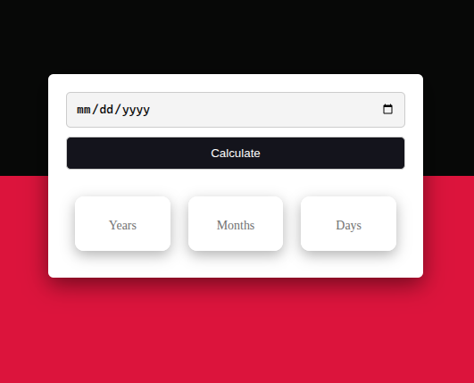
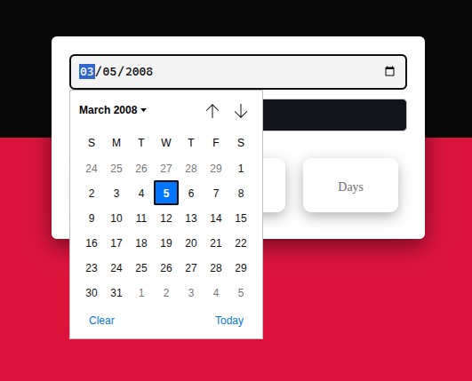
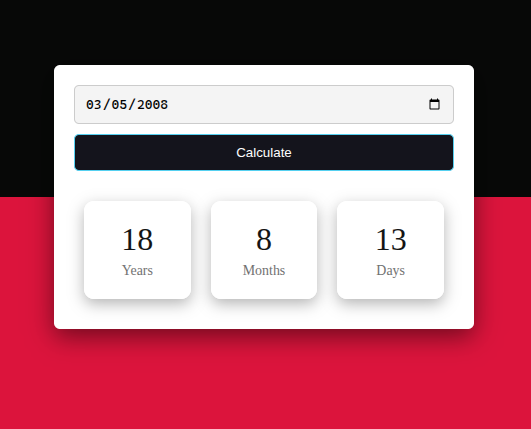

# Age Calculator

A simple and responsive Age Calculator built using HTML, CSS, and JavaScript. Users can select their date of birth and instantly calculate their age in years, months, and days.

## Preview

The application allows users to:

- Select a birth date
- Calculate age with a single click
- View age in:
  - Years
  - Months
  - Days

- Receive validation for future dates

## Features

- Clean and responsive user interface
- Date picker input
- Instant age calculation
- Input validation
- Mobile-friendly design
- Pure HTML, CSS, and JavaScript
- No external libraries required

## Project Structure

```text
age-calculator/
│
├── index.html
├── style.css
├── script.js
└── README.md
```

## Technologies Used

- HTML5
- CSS3
- JavaScript (ES6)

---

## How It Works

1. User selects a birth date.
2. The application compares the selected date with the current date.
3. The difference between the dates is calculated.
4. The result is displayed as:
   - Years
   - Months
   - Days

### Main Calculation Logic

```javascript
const diffTime = currentTime - birthTime;
```

The time difference is converted into:

```javascript
Years;
Months;
Days;
```

and displayed on the screen.

## Input Validation

The application checks for invalid dates:

- Future dates are rejected.
- An alert is shown when an invalid date is entered.
- Result fields are reset when validation fails.

Example:

```javascript
if (birthTime > currentTime) {
  alert("Please Enter a Valid Date");
}
```

---

## Screenshot

<p>
  
  
  
</p>
---
## Learning Concepts Covered

This project helps practice:

- JavaScript Date Object
- DOM Manipulation
- Event Handling
- Input Validation
- Responsive Design
- CSS Flexbox
- Time Calculations

## Browser Compatibility

Supported browsers:

- Google Chrome
- Mozilla Firefox
- Microsoft Edge
- Brave
- Opera
- Safari

## Known Limitation

The current implementation uses approximate values:

```javascript
356 days = 1 year
30.44 days = 1 month
```

This may produce slight inaccuracies because actual months and years have varying lengths and leap years are not fully accounted for.

For production applications, a calendar-based calculation approach is recommended.

## License

This project is licensed under the MIT License.

## Author

Created by Harsh.

A beginner-friendly project for learning JavaScript date handling, calculations, and DOM manipulation.
