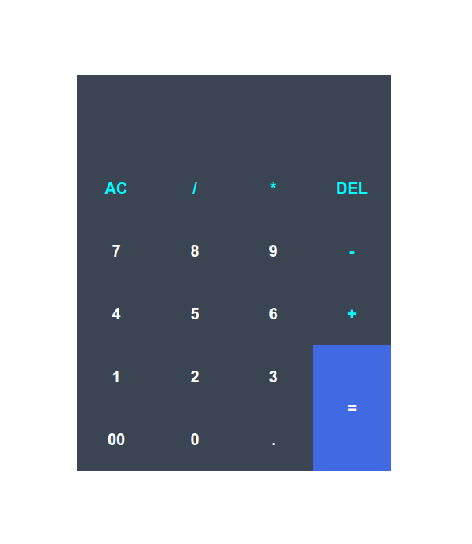
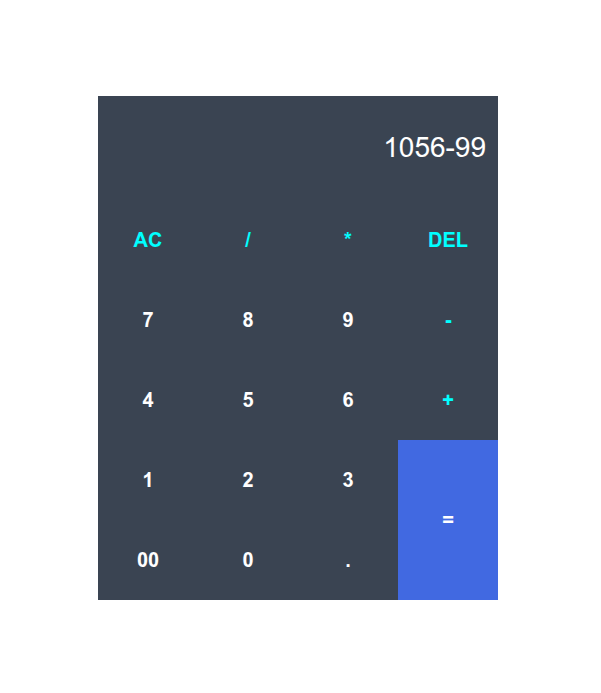

# Calculator Project

A simple calculator built using HTML, CSS, and JavaScript.

## 📌 About

This project performs basic arithmetic operations like:
- Addition (+)
- Subtraction (-)
- Multiplication (*)
- Division (/)

It is built for learning JavaScript DOM manipulation and basic logic building.

## 🚀 Features

- Simple and clean UI
- Basic math operations
- Prevents multiple consecutive operators
- Easy to use

## 🛠 Technologies Used

- HTML
- CSS
- JavaScript

## 📷 Preview

  
  
  

