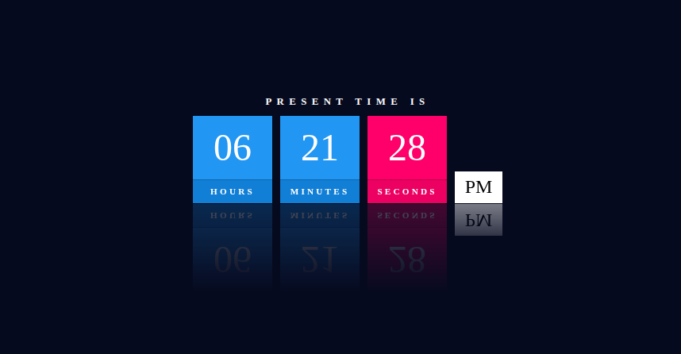

# Digital Clock

A simple and responsive Digital Clock built using HTML, CSS, and JavaScript. The clock displays the current time in a 12-hour format with Hours, Minutes, Seconds, and AM/PM indicators.

## Preview

The application displays:

* Current Hours
* Current Minutes
* Current Seconds
* AM/PM Status
* Modern UI with reflection effects
* Real-time updates every second

## Features

* Real-time clock updates every second
* 12-hour time format
* Automatic AM/PM detection
* Responsive layout
* Modern glass-like reflection effect
* Pure HTML, CSS, and JavaScript
* No external libraries required

## Project Structure

```text
digital-clock/
│
├── index.html
├── style.css
├── script.js
└── README.md
```

## Technologies Used

* HTML5
* CSS3
* JavaScript (Vanilla JS)

---
## How It Works

The JavaScript file:

1. Retrieves the current system time using the `Date()` object.
2. Extracts:

   * Hours
   * Minutes
   * Seconds
3. Converts time from 24-hour format to 12-hour format.
4. Determines whether the time is AM or PM.
5. Updates the DOM every second using:

```javascript
setInterval(clock, 1000);
```
---
## Screenshot


<p>
  
</p>

---

## Browser Support

Works on all modern browsers:

* Google Chrome
* Mozilla Firefox
* Microsoft Edge
* Brave
* Opera
* Safari

## License

This project is open-source and available under the MIT License.

## Author

Created by Harsh.
