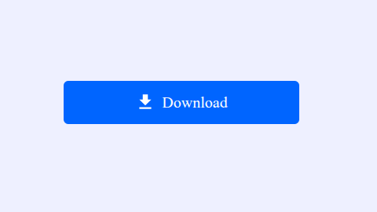
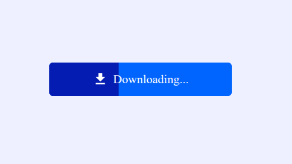

# Progress Download Button

A modern Progress Download Button built using HTML, CSS, and JavaScript. The button simulates a file download by displaying an animated progress bar and updating its text from **Download** to **Downloading...** and finally **Downloaded**.

## Preview

The application features:

* Animated progress bar
* Download simulation
* Dynamic button text updates
* Smooth CSS animations
* Responsive design
* Pure HTML, CSS, and JavaScript

## Features

* One-click download animation
* Animated progress overlay
* Dynamic status text
* Modern UI design
* Lightweight implementation
* No external libraries required
* Easy to customize


## Project Structure

```text
progress-download-button/
│
├── index.html
├── style.css
├── script.js
└── README.md
```

## Technologies Used

* HTML5
* CSS3
* JavaScript (ES6)

---

## How It Works

1. The user clicks the **Download** button.
2. JavaScript adds the `progress` class to the button.
3. CSS animates the progress overlay using keyframes.
4. The button text changes to **Downloading...**.
5. After the animation completes, the text changes to **Downloaded**.

### JavaScript Logic

```javascript
button.addEventListener("click", () => {
  button.classList.add("progress");
  text.innerText = "Downloading...";

  setTimeout(() => {
    button.classList.remove("progress");
    text.innerText = "Downloaded";
  }, 6000);
});
```

## CSS Animation

The progress effect is created using a pseudo-element (`::before`) that slides from left to right.

```css
.button.progress::before {
  animation: progress 6s ease-in-out forwards;
}
```
---

## Screenshot

<p>
  
  
</p>

---
## Learning Concepts Covered

This project helps practice:

* DOM Manipulation
* Event Handling
* CSS Keyframe Animations
* CSS Pseudo-elements
* JavaScript Timers
* Dynamic Class Manipulation
* Responsive UI Design


## Browser Compatibility

Compatible with all modern browsers:

* Google Chrome
* Mozilla Firefox
* Microsoft Edge
* Brave
* Opera
* Safari

## License

This project is licensed under the MIT License.

## Author

Created by Harsh.

---

A beginner-friendly project for learning CSS animations, JavaScript event handling, and interactive UI components.
