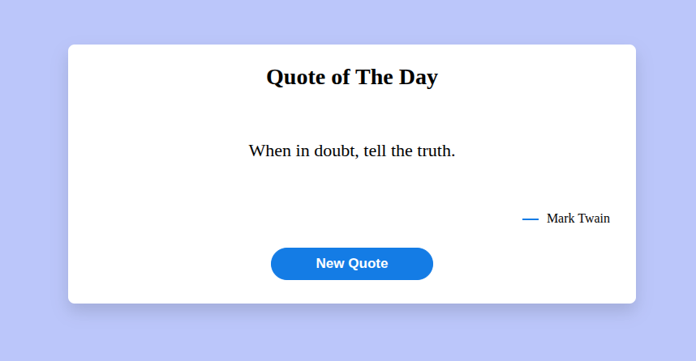
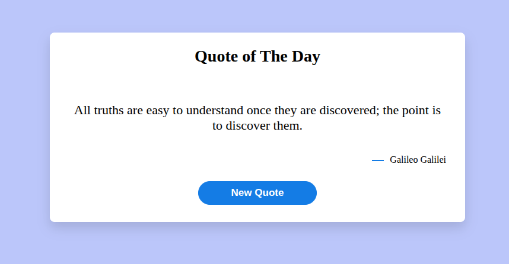
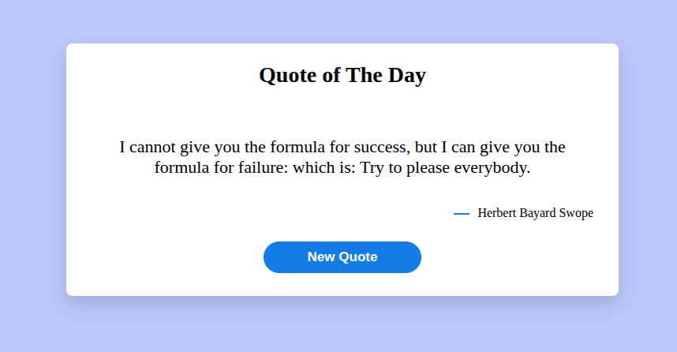

# Random Quote Generator

A simple and elegant Random Quote Generator built using HTML, CSS, and JavaScript. The application fetches inspirational quotes from an external API and displays them dynamically with the author's name.

## Preview

The application displays:

* Random inspirational quotes
* Quote author information
* Clean and responsive user interface
* One-click quote generation
* Real-time API integration

## Features

* Fetches random quotes from an API
* Displays quote content and author
* Generate a new quote with a single button click
* Responsive design
* Lightweight and fast
* Built with pure HTML, CSS, and JavaScript

## Project Structure

```text
random-quote-generator/
│
├── index.html
├── style.css
├── script.js
└── README.md
```

## Technologies Used

* HTML5
* CSS3
* JavaScript (ES6+)
* Fetch API

---
## How It Works

1. The application loads and automatically requests a quote from the API.
2. JavaScript uses the Fetch API to retrieve quote data.
3. The quote content and author are displayed on the page.
4. Clicking the **New Quote** button fetches another random quote instantly.

### API Endpoint

```javascript
const apiURL = "https://api.quotable.io/random";
```

### Example Response

```json
{
  "_id": "example-id",
  "content": "Success is not final, failure is not fatal.",
  "author": "Winston Churchill"
}
```
---
## Screenshots

<p>
  
  
  
</p>

---
## Browser Compatibility

Supported on all modern browsers:

* Google Chrome
* Mozilla Firefox
* Microsoft Edge
* Brave
* Opera
* Safari

## Learning Concepts Covered

This project helps practice:

* DOM Manipulation
* Asynchronous JavaScript
* Fetch API
* JSON Handling
* Event Handling
* CSS Flexbox
* Responsive Design

## License

This project is licensed under the MIT License.

## Author

Created by Harsh.


