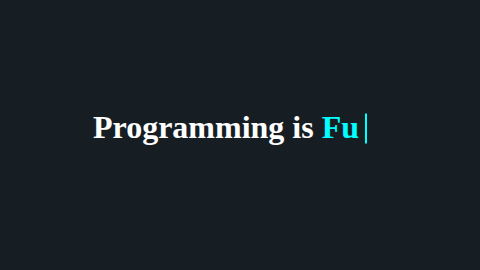
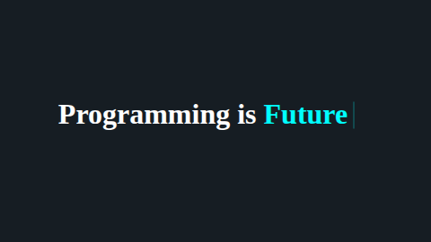

# Typing Text Effect

A simple and interactive Typing Text Animation built using HTML, CSS, and JavaScript. The application creates a typewriter-style effect that cycles through multiple words by typing and deleting characters dynamically.

## Preview

The animation displays:

```text
Programming is Art
Programming is Creation
Programming is Future
```

The words are typed character-by-character, paused, then erased before the next word appears.

## Features

* Smooth typing animation
* Character-by-character deletion effect
* Blinking cursor animation
* Infinite word cycling
* Lightweight and responsive design
* Pure HTML, CSS, and JavaScript
* Easy to customize with your own words

## Project Structure

```text
typing-text-effect/
│
├── index.html
├── style.css
├── script.js
└── README.md
```

## Technologies Used

* HTML5
* CSS3
* JavaScript (ES6)

---

## How It Works

The application maintains three states:

* Current word index
* Current character index
* Typing or deleting mode

### Word Array

```javascript
const words = ["Art", "Creation", "Future"];
```

### Animation Flow

1. Type each character one by one.
2. Pause after the word is complete.
3. Delete characters one by one.
4. Move to the next word.
5. Repeat infinitely.

### Main Variables

```javascript
let wordIndex = 0;
let charIndex = 0;
let isDeleting = false;
```

## Customization

### Change Displayed Words

Modify the array inside `script.js`:

```javascript
const words = [
  "Innovation",
  "Problem Solving",
  "Creativity",
  "Engineering"
];
```

### Adjust Typing Speed

Typing speed:

```javascript
setTimeout(typeEffect, 200);
```

Deleting speed:

```javascript
setTimeout(typeEffect, 100);
```

Pause before switching words:

```javascript
setTimeout(typeEffect, 1200);
```

## Learning Concepts Covered

This project helps practice:

* DOM Manipulation
* String Methods
* JavaScript Timers
* CSS Animations
* State Management
* Conditional Logic
* Dynamic Content Updates
---
## Screenshot

<p>
  
  
  
  
  
</p>

---
## Browser Support

Compatible with modern browsers:

* Google Chrome
* Mozilla Firefox
* Microsoft Edge
* Brave
* Opera
* Safari

## License

This project is licensed under the MIT License.

## Author

Created by Harsh.


A beginner-friendly project for learning JavaScript animations and DOM manipulation.
